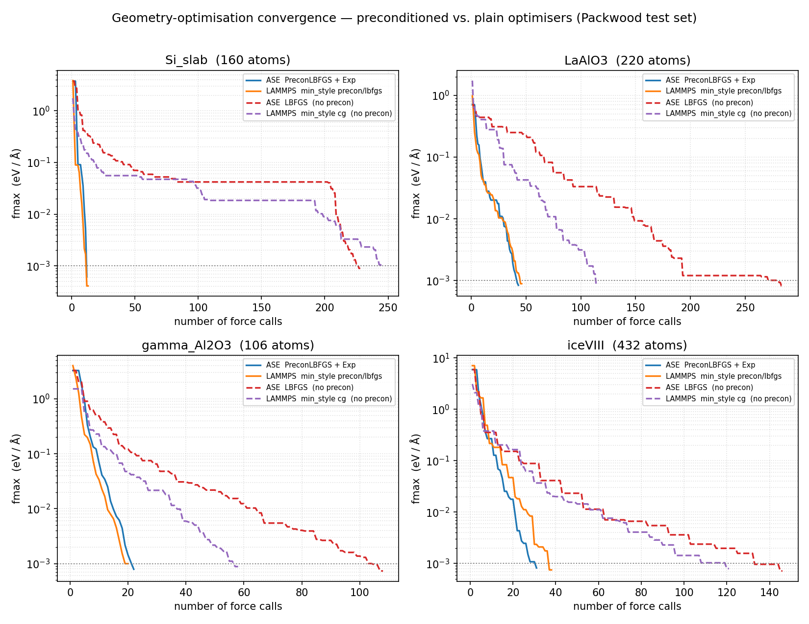

# lammps-precon-opt

[](https://github.com/jameskermode/lammps-precon-opt-fix/actions/workflows/ci.yml)

Standalone **`Exp` preconditioner** ([Packwood et al., J. Chem Phys. 2016](https://doi.org/10.1063/1.4947024)) for
geometry optimisation in **LAMMPS**, working across arbitrary interatomic potentials.

A LAMMPS-native C++ plugin (`fix precon/exp` + `min_style precon/lbfgs`) plus a
Python reference implementation validated stage-by-stage against ASE's reference
`Exp`. See [`spec.md`](spec.md) for the full specification.

## Architecture

- **C++ plugin** (`cpp/`) — a runtime LAMMPS plugin providing `fix precon/exp` and
  `min_style precon/lbfgs`. The preconditioner `P` is row-distributed and the linear
  solve is a hand-written distributed Jacobi-CG (`P·v` = halo exchange + local
  matvec), so it runs correctly under `mpirun` with **no external linear-algebra
  dependency**. Supports fixed and variable cell.
- **Python reference** (`src/lammps_precon/`) — the same algorithm orchestrated from
  Python, validated stage-by-stage against ASE's `ase.optimize.precon.Exp`. This is
  the authoritative reference the C++ port is checked against: **ASE ← Python ← C++**.
- **Force engine** — potential-agnostic. Validated with both
  [Symmetrix](https://github.com/wcwitt/symmetrix) (`pair_style symmetrix/mace`, a
  MACE foundation model) and a classical Cu/EAM potential.

## Installation

### Generic (any Linux)

Prerequisites: a C++20 compiler (GCC ≥ 13), OpenMPI, CMake ≥ 3.20, Python 3.12,
and [`uv`](https://docs.astral.sh/uv/).

1. **Build LAMMPS** with the `PLUGIN` package (C++20, shared library):

   ```bash
   git clone -b release https://github.com/lammps/lammps.git lammps-symmetrix/lammps
   cmake -S lammps-symmetrix/lammps/cmake -B lammps-symmetrix/lammps/build \
       -D CMAKE_BUILD_TYPE=Release -D CMAKE_CXX_STANDARD=20 \
       -D BUILD_MPI=yes -D BUILD_SHARED_LIBS=yes \
       -D PKG_PLUGIN=yes -D PKG_MANYBODY=yes
   cmake --build lammps-symmetrix/lammps/build -j
   ```

   The plugin must be **C++20** to ABI-match LAMMPS (its headers then resolve `fmt`
   to `std::format`). For the MACE engine, also clone and patch in Symmetrix — see
   `scripts/build_lammps.sh`.

2. **Build the plugin:**

   ```bash
   cmake -S cpp -B cpp/build -D LAMMPS_SOURCE_DIR=$PWD/lammps-symmetrix/lammps/src
   cmake --build cpp/build -j        # -> cpp/build/liblammps_precon.so
   ```

3. **Python environment** (for the validation suite):

   ```bash
   uv sync                                          # ASE + the other deps
   LAMMPS_VERSION_FILE=$PWD/lammps-symmetrix/lammps/src/version.h \
       uv pip install ./lammps-symmetrix/lammps/python   # LAMMPS Python module
   ```

   The `lammps` module loads `liblammps.so` at run time, so put the LAMMPS
   build directory on `LD_LIBRARY_PATH` before running `lmp` or the test suite:

   ```bash
   export LD_LIBRARY_PATH=$PWD/lammps-symmetrix/lammps/build:$LD_LIBRARY_PATH
   ```

4. **(MACE engine only)** convert a MACE foundation model to Symmetrix JSON —
   pass the path to your downloaded `.model` file:

   ```bash
   python scripts/convert_model.py /path/to/MACE-matpes-pbe-omat-ft.model
   ```

### HPC convenience

On an HPC system with the Lmod module system, `bash scripts/build_lammps.sh` does
all of the above (LAMMPS + Symmetrix + Kokkos, the `uv` environment,
runtime-library bundling) using `foss/2023b` modules; `bash
cpp/scripts/build_plugin.sh` then builds the plugin.

## Usage

Load the plugin and use the fix + min_style from a LAMMPS input script:

```
plugin load /path/to/cpp/build/liblammps_precon.so
# ... read_data, pair_style, etc. ...
atom_modify map array
fix pc all precon/exp
min_style precon/lbfgs
min_modify norm max
minimize 0.0 1e-3 1000 100000
```

Variable-cell relaxation adds `fix box/relax` (the cell must be triclinic):

```
change_box all triclinic
fix pc all precon/exp
fix br all box/relax tri 0.0 vmax 0.01
min_style precon/lbfgs
minimize 0.0 1e-3 3000 600000
```

It runs under MPI unchanged: `mpirun -np N lmp -in input.lammps`.

## Validation

```bash
python -m pytest                      # full stage-by-stage parity suite

# or run an individual stage harness:
python -m lammps_precon.reference     # Stage 0: ASE reference harness
python -m lammps_precon.neighbours    # Stage 1: neighbour-list / r_NN parity
python -m lammps_precon.assembly      # Stage 2: P-matrix assembly parity
python -m lammps_precon.mu            # Stage 3: mu-estimation parity
python -m lammps_precon.solve         # Stage 4: two-tier sparse solver parity
python -m lammps_precon.relax         # Stage 5: fixed-cell relaxation parity
python -m lammps_precon.vcrelax       # Stage 6: variable-cell relaxation parity
python -m lammps_precon.scaling       # Stage 7: scaling validation
python -m lammps_precon.cpp_parity    # Stage 8a: C++ plugin parity
python -m lammps_precon.cpp_mpi       # Stage 8b: MPI domain-decomposition parity
python -m lammps_precon.cpp_vcrelax   # Stage 8c: variable-cell parity
```

Per-stage artifacts land in `artifacts/stage0/` … `artifacts/stage8/`.

The GitHub Actions CI (`.github/workflows/ci.yml`) builds LAMMPS + the plugin on a
clean machine — caching the LAMMPS build keyed by its commit — and runs the
classical-EAM smoke tests (`tests/test_ci_smoke.py`); the Symmetrix/MACE tests
self-skip there (they need the foundation model).

## Convergence



Lowest `fmax` reached against the number of force evaluations, on the four
Packwood test structures. The **preconditioned** optimisers — ASE's
`PreconLBFGS` + `Exp` and the C++ plugin's `min_style precon/lbfgs` — reach the
10⁻³ eV/Å tolerance in a few dozen force calls; the **plain** optimisers — ASE
`LBFGS` and LAMMPS `min_style cg` — need several times more. Regenerate with
`python scripts/plot_convergence.py`.

The two preconditioned optimisers share an identical LBFGS recursion, so they
track each other closely. `scripts/maxstep_study.py` further shows that with
an Armijo-based line search the per-atom step cap (ASE `maxstep`, LAMMPS
`min_modify dmax`) is **not needed** — setting it to 1.0 Å (effectively "off")
converges in fewer force calls than ASE's stock 0.04 default on every Packwood
structure, with no divergence: the Armijo condition handles safety on its own.
The Python orchestration (`relax.py`, `vcrelax.py`) uses `MAXSTEP=1.0`
accordingly, and the C++ plugin's `min_style precon/lbfgs` likewise overrides
LAMMPS's stock `dmax=0.1` default to `1.0` from its constructor — override
with `min_modify dmax ...` if needed (e.g. for `min_modify line forcezero`,
which is *not* Armijo-based).

## Layout

| Path | Contents |
|------|----------|
| `cpp/` | the C++ LAMMPS plugin: `fix precon/exp` + `min_style precon/lbfgs` |
| `src/lammps_precon/` | the Python reference implementation + validation harnesses |
| `structures/` | test structures (Packwood set + generated) |
| `tests/` | stage-by-stage pytest parity checks |
| `scripts/` | build + model-conversion scripts |
| `spec.md` | the full specification |
| `lammps-symmetrix/`, `models/` | external clones / generated (gitignored) |

## Status

**Complete — all of [`spec.md`](spec.md) (Stages 0–8) is implemented and validated;
208/208 parity tests pass.**

- **Stages 0–7** — the Python reference: neighbour lists, `P` assembly, `μ`
  estimation, the two-tier solver, fixed- and variable-cell `PreconLBFGS`
  relaxations, and scaling — each matches ASE's reference `Exp` to machine
  precision (identical force-evaluation counts).
- **Stage 8a** — C++ LAMMPS-native plugin: `P` matches the Python assembly to
  ~1e-16, `μ` to ~1e-14, relaxations reach the Stage-5 minima.
- **Stage 8b** — domain decomposition: row-distributed `P`, distributed Jacobi-CG.
  On 1/2/4 MPI ranks the relaxation gives identical force-eval counts.
- **Stage 8c** — variable cell: `min_style precon/lbfgs` drives `fix box/relax`
  (`μ_c` from a finite-difference probe, cell DOF in a separate LBFGS recursion);
  reaches the Stage-6 minima.
